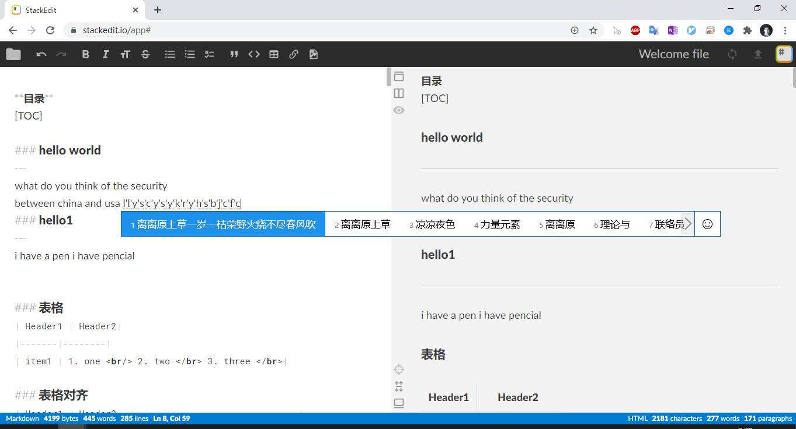
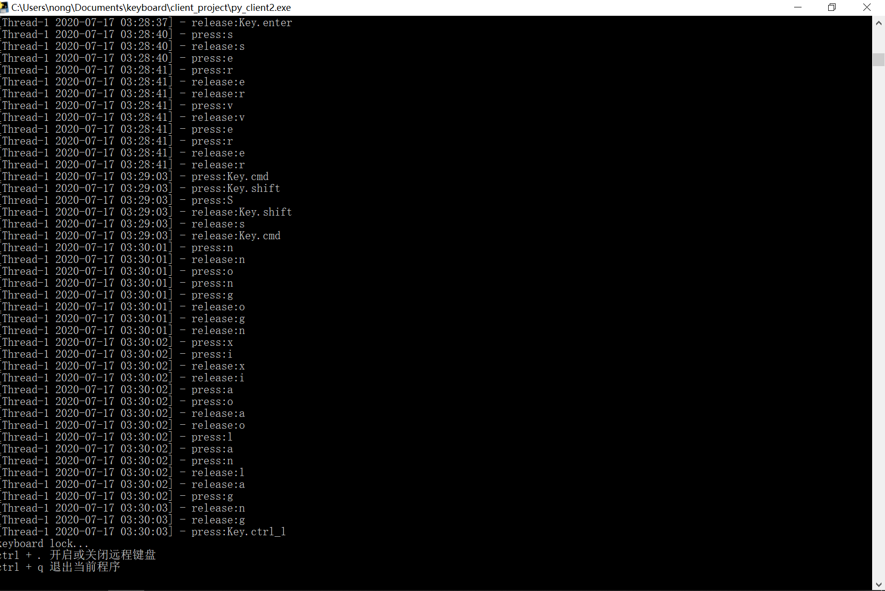

<style>
	.img {
		list-style:none;
		float:left;
		width:50%;
	   }
</style>
### 介绍
---
本项目提供远程键盘输入的功能，双手不用离开键盘,通过一台电脑对另一台电脑进行键盘输入。

<ul>
	<li class="img"><center>图1 server端(电脑1)</center></li>
	<li class="img"><center>图2 client端(电脑2)</center></li>
</ul>
<center>(可以利用电脑2的键盘在电脑1上进行输入)</center>


如果你存在使用两台机子的场景，比如一台Linux的机子一台Windows的机子，或者一台主机一台笔记本，
当你需要从一台机子切换到另一台机子进行键盘输入，那么常见的操作是你的手需要从一个键盘移动
到另一个键盘，如果此时手指不需要离开键盘就能切换机器进行输入，那么这样是不是很方便呢。
基于以上的场景，本软件可以通过快捷键的方式从一台机子切换到另一台机子进行输入。

开发这个项目的背景是我有台ThinkPad的键盘坏掉了，但是不想就此放弃掉使用了5年ThinkPad，
如果拿去修的话对于一个旧电脑来说有点奢侈，想到手上还有一个能用的surface go,虽然
surface go不能胜任开发任务，但是起码打字还是可以的，用来当ThinkPad的键盘再适合
不过了。有了这个电子后，就开发了这个远程键盘。

目前这个软件已经用了一些时间，不仅节省了一笔维修费用，还可以充分利用两个电脑的资源，
更好的是利用2个cpu，感觉用了几年的的电脑如丝般顺滑。

### 环境
---
* java
* python

### quick start
---
被控制的电脑
```
1. 进入server_project目录
2. python py_server2.py
```

控制的电脑(用来键盘输入的电脑）
```
1. 进入client_project目录
2. python py_client2.py
```

功能快捷键
```
1. 切换机器进行键盘输入 ctrl+.
2. 退出远程键盘  ctrl+q
```

### 在没有开发环境的电脑上运行程序
---
一般情况下，用户的机器上没有python和Java环境(当然本项目的初衷是为了解决程序员开发过程中不同机子
输入切换的问题，程序员的机器默认存在Java和python环境),所以我打包了exe文件放在release中。
* 被控制电脑运行server.exe
* 进行键盘输入的电脑运行client.exe

